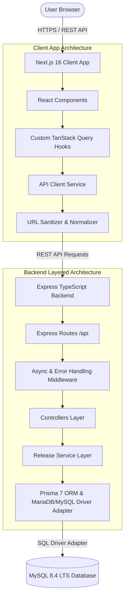

# Release Checklist Tool - Architecture & System Design Documentation

This document provides a detailed breakdown of the technical architecture, design patterns, folder structure, database schema, data flow, and deployment strategy for the **Release Checklist Tool**.

---

## 📐 System Architecture Diagram



---

## 💡 Engineering Highlights & Key Design Decisions

### 1. TanStack Query (@tanstack/react-query) for Client State
Rather than relying on imperative `useState + useEffect` fetch patterns, the client app utilizes **TanStack Query** for client-side data management:
- **Declarative Queries**: `useReleasesQuery` and `useStepsQuery` manage background fetching, loading states, and automatic caching.
- **Cache Invalidation**: Mutations (`useCreateReleaseMutation`, `useUpdateReleaseMutation`, `useDeleteReleaseMutation`) automatically invalidate the `['releases']` query key (`queryClient.invalidateQueries`), forcing the UI to update reactively without fragile manual state sync.
- **Resilient API URL Sanitizer**: The API service layer (`client/src/services/api.ts`) normalizes protocol headers (`https://`) and formats `/api` endpoints automatically, guarding against configuration errors in deployment environments.

### 2. Backend Layered Architecture (Separation of Concerns)
The backend enforces strict separation between HTTP routing, request handling, business logic, and database operations:
- **Routes Layer (`server/src/routes/`)**: Mounts REST endpoints under `/api` (`/api/releases`, `/api/steps`).
- **Controllers Layer (`server/src/controllers/`)**: Manages HTTP status codes (200, 201, 400, 404), extracts request params/body, and sends JSON responses.
- **Services Layer (`server/src/services/`)**: Encapsulates pure business logic and database queries using Prisma ORM.
- **Database Layer (`server/src/db/`)**: Configures Prisma 7 `PrismaClient` with `PrismaMariaDb` driver adapter and seeds default records on empty database startup.
- **Middleware (`server/src/middleware/`)**: Global error handler (`errorHandler`) and `asyncHandler` wrapper catching uncaught async exceptions.

### 3. Dynamic Status Calculation Logic
The release status (`planned`, `ongoing`, `done`) is computed dynamically based on the number of completed step IDs:

```ts
export function computeStatus(completedSteps: string[]): ReleaseStatus {
  const totalSteps = PREDEFINED_STEPS.length; // 7 steps
  const count = completedSteps.length;
  if (count === 0) return 'planned';
  if (count >= totalSteps) return 'done';
  return 'ongoing';
}
```

---

## 📂 Codebase Directory Structure

```text
release-checklist/
├── README.md                  # Project overview & quickstart guide
├── ARCHITECTURE.md            # In-depth technical architecture documentation (This File)
├── client/                    # Next.js SPA Frontend
│   ├── src/
│   │   ├── app/
│   │   │   ├── layout.tsx     # Root layout with QueryClientProvider
│   │   │   └── page.tsx       # Main page orchestrating SPA views
│   │   ├── components/
│   │   │   ├── ReleaseList.tsx    # Releases table view
│   │   │   ├── ReleaseForm.tsx    # Create / Edit detail form
│   │   │   ├── ReleaseStatusBadge.tsx # Status pill (Done, Ongoing, Planned)
│   │   │   ├── DeleteModal.tsx    # Delete confirmation modal
│   │   │   ├── Header.tsx         # Title & subtitle header
│   │   │   ├── Toast.tsx          # Real-time toast banner
│   │   │   └── Providers.tsx      # TanStack QueryClientProvider wrapper
│   │   ├── hooks/
│   │   │   └── useReleases.ts     # TanStack Query hooks & mutations
│   │   ├── services/
│   │   │   └── api.ts             # API client with URL sanitizer
│   │   ├── types/
│   │   │   └── release.ts         # TypeScript interfaces & DTOs
│   │   └── utils/
│   │       └── formatters.ts      # Date formatters & status calculation
│   └── package.json
│
└── server/                    # Express + TypeScript + Prisma Backend
    ├── prisma/
    │   └── schema.prisma      # Prisma 7 database schema
    ├── prisma.config.ts       # Prisma 7 configuration file
    ├── docker-compose.yml     # Local container setup (MySQL 8.4 + Node Server)
    ├── Dockerfile             # Multi-stage Docker build file
    ├── vercel.json            # Vercel serverless deployment config
    ├── init.sql               # MySQL database seed script
    ├── src/
    │   ├── config/
    │   │   └── env.ts         # Environment configuration loader
    │   ├── constants/
    │   │   └── steps.ts       # Predefined 7 checklist steps
    │   ├── controllers/
    │   │   ├── releaseController.ts # HTTP request handlers for releases
    │   │   └── stepController.ts    # HTTP request handler for steps
    │   ├── db/
    │   │   └── prisma.ts      # Prisma Client connection & auto-seed
    │   ├── middleware/
    │   │   └── errorHandler.ts# Global error handler middleware
    │   ├── routes/
    │   │   ├── index.ts       # Main API router mounting sub-routes
    │   │   ├── releaseRoutes.ts # /api/releases endpoints
    │   │   └── stepRoutes.ts  # /api/steps endpoint
    │   ├── services/
    │   │   └── releaseService.ts# Business logic & Prisma ORM queries
    │   ├── types/
    │   │   └── release.ts     # Backend TypeScript domain interfaces
    │   ├── utils/
    │   │   └── status.ts      # Status computation logic
    │   ├── index.ts           # Express application setup
    │   └── index.test.ts      # Integration tests (Jest + Supertest)
    └── package.json
```

---

## 🗄️ Database Schema & Data Models

### Table: `releases`

| Column Name | Prisma Type | Constraints | Description |
| :--- | :--- | :--- | :--- |
| `id` | `Int` | `@id @default(autoincrement())` | Unique release identifier |
| `name` | `String` | `NOT NULL` | Release title / version name |
| `due_date` | `DateTime` | `NOT NULL` | Target release date |
| `additional_info` | `String?` | `@db.Text` | Optional remarks or notes |
| `completed_steps` | `Json` | `NOT NULL` | Array of completed step IDs (`["step-1", "step-2"]`) |
| `created_at` | `DateTime` | `@default(now())` | Creation timestamp |
| `updated_at` | `DateTime` | `@updatedAt` | Last updated timestamp |

---

## 📡 API Specification Table

| Method | Endpoint | Description | Request Payload | Response Code |
| :--- | :--- | :--- | :--- | :--- |
| `GET` | `/api/health` | Service health check | None | `200 OK` |
| `GET` | `/api/steps` | Get 7 predefined checklist steps | None | `200 OK` |
| `GET` | `/api/releases` | List all releases with computed status | None | `200 OK` |
| `GET` | `/api/releases/:id` | Get release by ID | None | `200 OK` / `404 Not Found` |
| `POST` | `/api/releases` | Create a new release | `{"name": "v1.0", "due_date": "2026-12-31"}` | `201 Created` / `400 Bad Request` |
| `PUT` | `/api/releases/:id` | Update release details / steps | `{"completed_steps": ["step-1"]}` | `200 OK` / `404 Not Found` |
| `PATCH` | `/api/releases/:id/steps` | Toggle step states array | `{"completed_steps": ["step-1", "step-2"]}` | `200 OK` / `404 Not Found` |
| `DELETE` | `/api/releases/:id` | Delete release by ID | None | `200 OK` / `404 Not Found` |

---

## 🐳 Containerization & Cloud Deployment

1. **Local Container Setup**: Located in `server/docker-compose.yml`. A single command (`cd server && docker compose up --build`) spins up:
   - MySQL 8.4 LTS container on port 3306 with health checks and initial SQL schema.
   - Express TypeScript container on port 8000.
2. **Backend Serverless (Vercel)**:
   - Exported Express `app` as default export.
   - Configured `server/vercel.json` routing all paths to `src/index.ts`.
   - Included `"vercel-build": "prisma generate && tsc"` in `server/package.json` to generate Prisma Client code prior to TypeScript compilation on Vercel.
3. **Frontend SPA (Vercel)**:
   - Deployed Next.js application with `NEXT_PUBLIC_API_URL` pointing to backend API endpoint.
